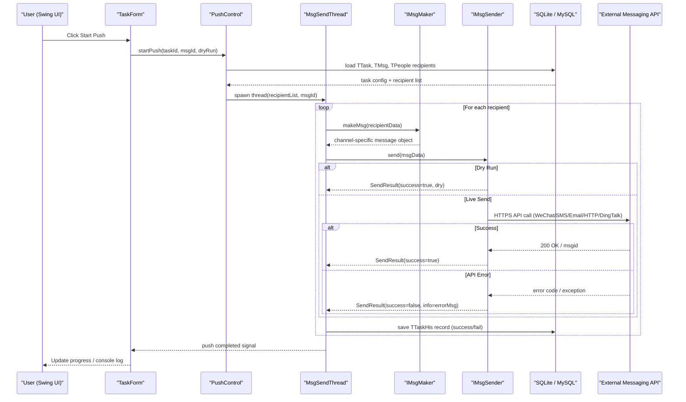

# API & Service Communication Contracts

WePush is a single-process desktop application with no inbound HTTP API surface; all communication is outbound-only, with the application acting as a client to external third-party messaging APIs and an optional SMTP server.

## Service Catalog

| Service | Port | Category | Purpose |
|---|---|---|---|
| WePush Desktop App | N/A (desktop process) | Business | Single deployable unit; orchestrates all outbound push message delivery |
| WeChat Official Account API | 443 (HTTPS) | External | Receives template, kefu, subscribe, and uniform messages via WeiXin Java SDK |
| WeChat Mini Program API | 443 (HTTPS) | External | Receives subscribe messages via WeiXin Java SDK |
| WeChat Enterprise (Work) API | 443 (HTTPS) | External | Receives enterprise messages via WeiXin Java SDK |
| SMTP Email Server | 25 / 465 / 587 (configurable) | External | Receives outbound email via JavaMail / Hutool Mail |
| Alibaba Cloud SMS API | 443 (HTTPS) | External | Receives SMS dispatch requests via aliyun-java-sdk-dysmsapi |
| Tencent Cloud SMS API | 443 (HTTPS) | External | Receives SMS dispatch requests via tencentcloud-sdk-java |
| Huawei / Baidu Cloud SMS API | 443 (HTTPS) | External | Receives SMS dispatch requests via bce-java-sdk |
| YunPian SMS API | 443 (HTTPS) | External | Receives SMS dispatch requests via yunpian-java-sdk |
| QCloud SMS API | 443 (HTTPS) | External | Receives SMS dispatch requests via qcloudsms |
| DingTalk Bot Webhook | 443 (HTTPS) | External | Receives group bot messages via OkHttp POST |
| Generic HTTP Endpoint | User-configured | External | Receives arbitrary HTTP GET/POST/PUT/PATCH/DELETE/HEAD requests |
| Qiniu Cloud Storage | 443 (HTTPS) | External | Receives file/object storage operations via qiniu-java-sdk |
| UpYun Storage | 443 (HTTPS) | External | Receives file/object storage operations via custom HTTP |
| SQLite (embedded) | N/A (in-process) | Infrastructure | Local embedded database for all application data |
| MySQL (optional) | 3306 (configurable) | Infrastructure | Optional external relational database |

## API Endpoints Inventory

WePush exposes **no inbound HTTP API endpoints**. It is a pure desktop client application. All outbound calls are delegated to the third-party SDK or OkHttp. The table below documents the **outbound API contracts** consumed by the application.

| Channel | Outbound Method | API / Endpoint | Request Contract | Response Contract |
|---|---|---|---|---|
| WeChat MP Template Message | SDK call | `WxMpService.getTemplateMsgService().sendTemplateMsg()` | `WxMpTemplateMessage` | `WxMpTemplateMessageResult` (msgid) |
| WeChat MP Kefu Message | SDK call | `WxMpService.getKefuService().sendKefuMessage()` | `WxMpKefuMessage` | success / exception |
| WeChat MP Subscribe Message | SDK call | `WxMpService.getMsgService().send()` | `WxMpSubscribeMessage` | success / exception |
| WeChat MP Uniform Message | SDK call | `WxMpService.getUniformMessageService().sendUniformMsg()` | `WxMpUniformMessage` | success / exception |
| WeChat Mini Program Subscribe | SDK call | `WxMaService.getMsgService().sendSubscribeMsg()` | `WxMaSubscribeMessage` | success / exception |
| WeChat Enterprise Message | SDK call | `WxCpService.getMessageService().send()` | `WxCpMessage` | `WxCpMessageSendResult` |
| Email (SMTP) | SMTP | Configured SMTP host:port | `MailMsg` (subject, body, to, cc, attachments) | success / exception |
| Alibaba Cloud SMS | HTTPS REST | `dysmsapi.aliyuncs.com/SendSms` | `SendSmsRequest` (phone, sign, template, params) | `SendSmsResponse` (Code, Message) |
| Tencent Cloud SMS | HTTPS REST | Tencent Cloud SMS endpoint | `SendSmsRequest` (phones, templateId, params) | `SendSmsResponse` |
| YunPian SMS | HTTPS REST | `sms.yunpian.com/v2/sms/single_send.json` | `YunpianMsg` (mobile, text) | JSON response (code, msg) |
| DingTalk Bot | HTTPS POST | Webhook URL (user-configured) | JSON body (msgtype, content) via OkHttp | JSON response |
| Generic HTTP | HTTP (any method) | User-configured URL | `HttpMsg` (URL, method, headers, params, body, cookies) | `HttpSendResult` (body, headers, cookies) |
| Qiniu Cloud Storage | HTTPS | Qiniu upload endpoint | `Auth` + stream data | JSON response (key, hash) |
| UpYun Storage | HTTPS REST | UpYun REST API | multipart form data | JSON response |

## Management & Observability Endpoints

WePush exposes no management or observability endpoints. It is a standalone desktop application with no embedded web server. Observability is limited to local log files produced by Logback.

| Service | Endpoint | Custom Metrics |
|---|---|---|
| WePush Desktop App | None — no embedded HTTP server | Task execution counts, success/fail counts are shown in the UI console panel only; no metrics export |

## DTOs & Contracts

WePush uses plain Java beans (no immutable records or Lombok `@Value`) as data carriers between layers. Key contract classes are:

- **`HttpMsg`** — Outbound HTTP message contract: URL, HTTP method, headers map, params map, body string, cookie list, body-type (MIME). Used by `HttpMsgMaker` → `HttpMsgSender`.
- **`MailMsg`** — Email message contract: subject, content (HTML), to-list, CC-list, BCC-list, attachment paths. Used by `MailMsgMaker` → `MailMsgSender`.
- **`SendResult`** — Generic send outcome: boolean success flag + info string. Returned by all `IMsgSender.send()` implementations.
- **`HttpSendResult`** — Extended send outcome for HTTP channel: extends `SendResult` with response body, headers, and cookies strings.
- **`TemplateData`** — Velocity template variable container: variable name → value mapping used for message template rendering.
- **`UserCase`** — User-scenario/use-case bean for demo/template seeding.
- **Account config beans** (`WxMpAccountConfig`, `EmailAccountConfig`, `HttpAccountConfig`, `AliYunAccountConfig`, etc.) — Deserialised from `TAccount.accountConfig` JSON column; carry channel-specific credentials and connection settings.

No OpenAPI/Swagger specifications, protobuf schemas, or GraphQL schemas exist — the application has no inbound API surface to document in machine-readable format. JSON serialization for account config storage uses **fastjson 1.2.74** (`JSON.parseObject` / `JSON.toJSONString`).

## Communication Patterns

**Synchronous outbound calls**: All message delivery is synchronous at the sender level. Each `IMsgSender.send()` implementation blocks the calling thread until the external API returns or times out. The HTTP channel uses OkHttp with a hard-coded 3-minute connect timeout (`connectTimeout(3, TimeUnit.MINUTES)`). WeChat and SMS SDK calls use their default timeouts (typically 10–30 s). No explicit read-timeout is set beyond the connect timeout for OkHttp.

**Concurrency model**: `PushControl` spawns one `MsgSendThread` per push run. Each thread iterates the recipient list and calls `IMsgSender.send()` sequentially within the thread. The number of parallel sender threads is bounded by `App.config.getMaxThreads()` (user-configured), which also governs the OkHttp `ConnectionPool` size.

**Async send stub**: `IMsgSender.asyncSend()` is defined in the interface and present on all implementations but returns `null` in every concrete class — asynchronous delivery is not implemented.

**Resilience patterns**: No circuit breaker, no retry policy, and no bulkhead pattern are implemented. A single call failure causes the individual recipient's send to be marked failed; the batch continues to the next recipient. There is no back-off or exponential retry.

**Proxy support**: The HTTP channel (`HttpMsgSender`) and WeChat MP SDK (`DefaultApacheHttpClientBuilder`) support optional HTTP proxy configuration stored in the account config.

**Service discovery**: Not applicable — WePush is a desktop application. External API URLs are either hard-coded in the SDKs or user-supplied at account configuration time.

**Security posture**: WePush makes all outbound calls over **HTTPS** (TLS) to cloud APIs. Credentials (AppId, AppSecret, API keys) are stored in the local SQLite database in the `TAccount.accountConfig` JSON column without encryption at rest. There is no inbound API surface, so authentication, authorization, and inbound TLS are not applicable. No token refresh, OAuth2 PKCE, or secret rotation mechanism is implemented.

## Service Technology Matrix

| Capability | WePush Desktop App |
|---|---|
| GUI Framework | Java Swing + FlatLaf 3.5.2 |
| Data Access | MyBatis 3.5.13 (SQLite / MySQL) |
| Outbound HTTP Client | OkHttp 4.9.1 + Hutool HTTP |
| Messaging SDKs | weixin-java-* 4.6.0, aliyun/tencent/huawei/yunpian SDKs |
| Scheduling | Quartz 2.3.2 |
| Service Discovery | None |
| API Gateway | None |
| Inbound Health Checks | None |
| Caching | In-memory maps (OkHttpClient, WxMpService, MailAccount per accountId) |
| Metrics Export | None |
| Logging | Logback 1.2.3 (local file) |

## Service Communication Sequence

