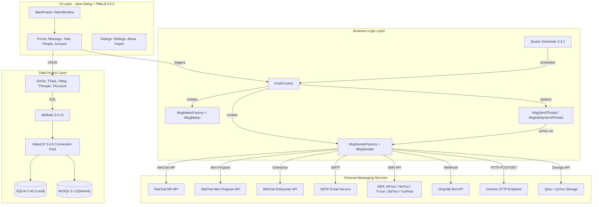
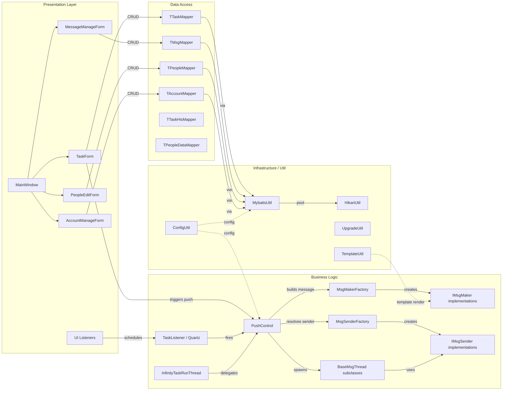

# Architecture Diagram

WePush is a desktop push notification tool built with Java Swing that enables batch message delivery across multiple messaging channels including WeChat, SMS, Email, DingTalk, and HTTP endpoints.

## Application Architecture

### Technology Stack Summary

| Layer | Technology | Version | Purpose |
|---|---|---|---|
| Presentation | Java Swing + FlatLaf | FlatLaf 3.5.2 | Desktop GUI framework with modern look-and-feel |
| Presentation | IntelliJ Forms Runtime | 7.0.3 | GUI form layout support |
| Business Logic | Java | 21 | Core application logic and threading |
| Business Logic | Quartz Scheduler | 2.3.2 | Scheduled and recurring push tasks |
| Business Logic | weixin-java-mp | 4.6.0 | WeChat MP (Official Account) messaging SDK |
| Business Logic | weixin-java-miniapp | 4.6.0 | WeChat Mini Program messaging SDK |
| Business Logic | weixin-java-cp | 4.6.0 | WeChat Enterprise messaging SDK |
| Business Logic | JavaMail (javax.mail) | 1.6.2 | Email delivery |
| Business Logic | Aliyun Java SDK | 4.4.2 / 1.1.0 | Alibaba Cloud SMS |
| Business Logic | Tencent Cloud SDK | 3.1.847 | Tencent Cloud SMS |
| Business Logic | Huawei BCE SDK | 0.10.134 | Baidu Cloud SMS |
| Business Logic | Hutool | 5.6.4 | General-purpose utility library |
| Data Access | MyBatis | 3.5.13 | ORM / SQL mapping |
| Data Access | HikariCP | 3.4.5 | JDBC connection pooling |
| Data Storage | SQLite | 3.43.0 | Embedded local database |
| Data Storage | MySQL | 5.x (optional) | External relational database |
| Serialization | Fastjson | 1.2.74 | JSON serialization |
| Logging | Logback | 1.2.3 | Application logging |

### Data Storage & External Services

WePush uses **SQLite** as its default embedded database (via MyBatis + HikariCP), storing tasks, messages, people lists, accounts, and import configurations locally without requiring external infrastructure. An optional **MySQL** connection is also supported for teams that prefer a shared relational database. External services are invoked at message-send time: **WeChat Official Account**, **WeChat Mini Program**, and **WeChat Enterprise** APIs are wrapped by the WeiXin Java SDK; **Email** is delivered via SMTP; multiple **SMS cloud providers** (Alibaba Cloud, Tencent Cloud, Huawei/Baidu Cloud, YunPian) are integrated via their respective Java SDKs; **DingTalk** robot webhooks, a generic **HTTP endpoint** channel, and **cloud storage** services (Qiniu, UpYun) are also supported.

### Key Architectural Decisions

- **Factory pattern for extensibility**: `MsgMakerFactory` and `MsgSenderFactory` decouple channel selection from business logic, making it trivial to add new messaging channels.
- **Multi-threaded push execution**: `MsgSendThread` and `MsgInfinitySendThread` run push jobs in background threads, keeping the Swing UI responsive during large batch sends.
- **MyBatis with XML mappers**: Data access uses MyBatis XML mapper files under `src/main/resources/mapper/`, providing explicit SQL control over an embedded SQLite or optional MySQL database.

## Component Relationships

### Component Inventory

| Component | Layer | Type | Responsibility |
|---|---|---|---|
| MainWindow | Presentation | Swing JPanel | Root window container, tab management |
| TaskForm | Presentation | Swing Form | Push task configuration and execution trigger |
| MessageManageForm | Presentation | Swing Form | Message template list and CRUD |
| MessageEditForm | Presentation | Swing Form | Message content editing per message type |
| PeopleEditForm | Presentation | Swing Form | Target audience management |
| AccountManageForm | Presentation | Swing Form | Platform account (WeChat/SMS/Email) configuration |
| MsgFormFactory | Presentation | Factory | Creates message-type-specific editing forms |
| AccountFormFactory | Presentation | Factory | Creates account-type-specific configuration forms |
| TaskListener | Business Logic | Event Listener | Handles UI task events and Quartz job scheduling |
| PushControl | Business Logic | Controller | Orchestrates the complete push execution flow |
| MsgMakerFactory | Business Logic | Factory | Instantiates the correct IMsgMaker for a message type |
| IMsgMaker impls | Business Logic | Strategy | Constructs channel-specific message objects |
| MsgSenderFactory | Business Logic | Factory | Instantiates the correct IMsgSender for a channel |
| IMsgSender impls | Business Logic | Strategy | Delivers messages to external APIs |
| BaseMsgThread | Business Logic | Thread | Base thread for batch message sending |
| MsgSendThread | Business Logic | Thread | Single-run batch send thread |
| MsgInfinitySendThread | Business Logic | Thread | Continuous/infinite send thread |
| InfinityTaskRunThread | Business Logic | Thread | Manages infinite recurring task loops |
| TTaskMapper | Data Access | MyBatis Mapper | CRUD for push tasks |
| TMsgMapper | Data Access | MyBatis Mapper | CRUD for message templates |
| TPeopleMapper | Data Access | MyBatis Mapper | CRUD for people/target lists |
| TAccountMapper | Data Access | MyBatis Mapper | CRUD for platform accounts |
| TTaskHisMapper | Data Access | MyBatis Mapper | Push task history records |
| TPeopleDataMapper | Data Access | MyBatis Mapper | Individual target person data |
| MybatisUtil | Infrastructure | Utility | MyBatis SqlSession factory management |
| HikariUtil | Infrastructure | Utility | HikariCP connection pool setup |
| ConfigUtil | Infrastructure | Utility | Application configuration loading/saving |
| UpgradeUtil | Infrastructure | Utility | Database schema migration on version upgrade |
| TemplateUtil | Infrastructure | Utility | Velocity template rendering for message variables |
