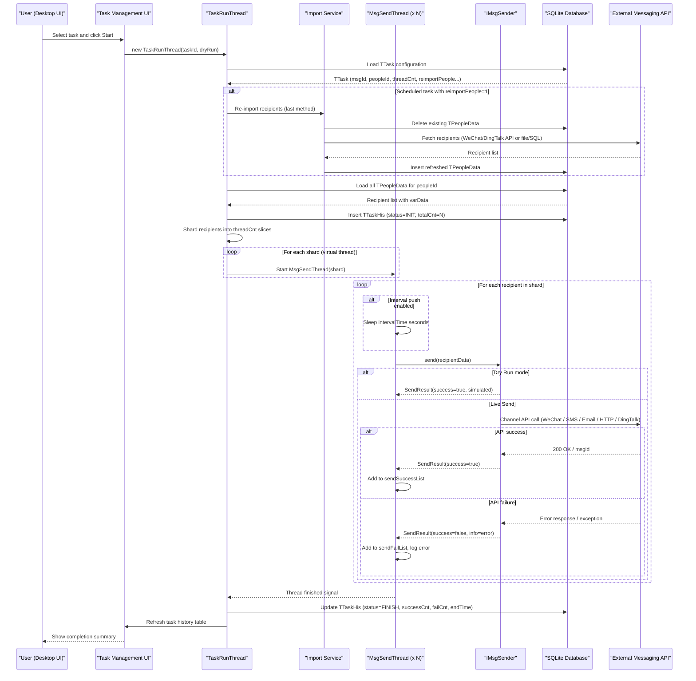

# Core Business Workflows

WePush is a desktop batch push-notification tool that allows users to compose messages, manage recipient lists, and deliver them at scale across 19 different messaging channels including WeChat, SMS, Email, DingTalk, and HTTP endpoints.

## Domain Entities

| Entity | Service / Bounded Context | Description | Key Relationships |
|---|---|---|---|
| TTask | Task Management | A named push job that combines a message template, a recipient group, an account, and execution settings | References TMsg, TAccount, and TPeople; owns many TTaskHis records |
| TTaskHis | Task Execution History | A single execution run of a task, capturing start/end times, success/fail counts, status, and result file paths | Belongs to one TTask |
| TMsg | Message Management | A reusable message template for a specific channel type; the `content` field is channel-specific JSON | Belongs to one TAccount; linked from TTask |
| TAccount | Account Management | Platform credentials and connection settings for one push channel (WeChat, SMS provider, SMTP, etc.) | Owns many TMsg records and TPeople records |
| TPeople | Recipient Group Management | A named group of push targets associated with a channel and account | Owns many TPeopleData records; has one TPeopleImportConfig |
| TPeopleData | Recipient Management | A single push target (openId, phone number, or identifier) plus template variable data | Belongs to one TPeople group |
| TPeopleImportConfig | Import Configuration | Stores the last-used import method and its parameters for a recipient group, enabling scheduled re-import | Belongs to one TPeople group |
| TWxMpUser | WeChat Follower Cache | Cached WeChat Official Account follower profile data pulled from WeChat API during import | Used during BY_WX_MP import; cleared and repopulated on each import |

## Service-to-Domain Mapping

WePush is a single-service desktop application; all bounded contexts exist within one process.

| Bounded Context | Domain Entities Owned | External Dependencies |
|---|---|---|
| Task Management | TTask, TTaskHis | None — purely local |
| Message Management | TMsg (+ channel-specific DTOs: MailMsg, HttpMsg) | External messaging APIs at send time |
| Account Management | TAccount (+ channel config beans) | External API credentials stored locally |
| Recipient Group Management | TPeople, TPeopleData, TPeopleImportConfig | File system (CSV/TXT/XLS), MySQL (optional), WeChat MP API, WeChat Enterprise API, DingTalk API |
| Push Execution Engine | TaskRunThread, MsgSendThread, IMsgSender implementations | All configured external messaging APIs |

## Primary Workflows

### Workflow 1: Batch Push Execution (One-time Task)

The primary business workflow — user selects a saved task and triggers an immediate push to all recipients in the linked people group.

**Steps:**
1. **Task selection**: User selects a task from the task list in the UI.
2. **Dry-run decision**: User chooses dry-run (simulate) or live send. The task's `dryRun` setting is passed to `TaskRunThread`.
3. **Recipient list preparation**: `TaskRunThread.preparePushRun()` loads all `TPeopleData` records for the task's `peopleId`. If the task is scheduled (`taskPeriod = SCHEDULE_TASK`) and `reimportPeople = 1`, the last import method is re-run first to refresh the recipient list.
4. **Task history record created**: A `TTaskHis` row is inserted with status `INIT`, capturing start time and total recipient count.
5. **Recipient sharding**: The full recipient list is divided into equal slices; one `MsgSendThread` is created per slice, up to `tTask.threadCnt` threads. Threads run as Java virtual threads.
6. **Per-recipient send loop**: Each `MsgSendThread` iterates its slice. For each recipient:
   - If **interval push** is enabled, the thread sleeps `intervalTime` seconds before each send.
   - `IMsgSender.send(msgData)` is called (live) or returns a mock success (dry-run).
   - On success: recipient added to `sendSuccessList`, `successRecords` counter incremented.
   - On failure: recipient added to `sendFailList`, `failRecords` counter incremented; error logged to task log file.
   - For HTTP channel with `saveResult = 1`: response body is appended to the recipient's data row.
7. **Completion**: When all threads finish, `TTaskHis` is updated with end time, success count, fail count, and status `FINISH`. UI task-history table is refreshed.
8. **Result export (optional)**: Success and failure lists are written to CSV files; paths stored in `TTaskHis`.
9. **Alert email (optional)**: If `resultAlert = 1` and `alertEmails` are configured, a summary email is sent.

### Workflow 2: Scheduled / Periodic Push Task

Tasks can be scheduled using a cron expression or a fixed period; the Hutool `Scheduler` (Cron) executes them automatically.

**Steps:**
1. **On application startup**: `TaskListener.addAllScheduledTask()` queries all tasks with a schedule and registers them with the Hutool `Scheduler`.
2. **At scheduled time**: The scheduler fires a `Task` that creates a new `TaskRunThread` (or `InfinityTaskRunThread` for `INFINITY_TASK` mode) and starts it.
3. **Re-import decision**: If `reimportPeople = 1`, the people group is re-imported from the last configured source before sending starts (same logic as Workflow 1, step 3).
4. **Execution**: Identical to Workflow 1, steps 4–9.

### Workflow 3: Recipient Import

Before a task can run, the target audience must be imported into a `TPeople` group.

**Steps:**
1. **Import method selection**: User selects one of six import methods:
   - **By File**: CSV, TXT (delimiter-separated), or XLS/XLSX file parsed row-by-row.
   - **By SQL**: Raw SQL query executed against the user-configured MySQL instance; each result row becomes a recipient.
   - **By Number**: Generate a numeric sequence of recipient identifiers.
   - **By WeChat MP**: WeChat MP API called to fetch all follower `openId` values; stored in `TWxMpUser` cache then bulk-inserted into `TPeopleData`.
   - **By WeChat Enterprise**: WeChat Enterprise API called to fetch department member lists.
   - **By DingTalk**: DingTalk API called to fetch organization member lists.
2. **Data parsing and variable extraction**: Each row is parsed into a `pin` (primary identifier) and a `varData` JSON array of template variable values.
3. **Persistence**: All `TPeopleData` records for the group are deleted, then re-inserted (full replacement). The import method and its parameters are saved to `TPeopleImportConfig` for future re-import.

### Workflow 4: Message Preview / Test Send

Before running a full task, a user can preview-send to a small set of target identifiers.

**Steps:**
1. User enters semicolon-separated target identifiers in the preview field of `MessageEditForm`.
2. `PushControl.preview(tMsgId)` creates an `IMsgSender` with `dryRun = 0` (live send).
3. Each identifier is sent immediately, and `SendResult` objects are collected and displayed.

### Workflow 5: Infinity Task (Variable-Rate Push)

An alternative execution mode where messages are sent in an open-ended loop rather than to a fixed recipient list.

**Steps:**
1. Task is configured with `taskMode = INFINITY_TASK`.
2. `InfinityTaskRunThread` runs inside `InfinityTaskHisDetailDialog`, continuously executing sends.
3. `MsgInfinitySendThread` sends one message per loop iteration at a configurable interval.
4. The loop continues until the user explicitly stops the task.

## Cross-Service Data Flows

WePush is a single-process application; there are no network-level cross-service data flows. Data composition occurs within the process:

- **Recipient data composition at send time**: When `TaskRunThread.preparePushRun()` loads recipients, it reads `varData` from `TPeopleData` as a JSON string array. At send time, `IMsgMaker.makeMsg(String[] msgData)` uses Velocity templates stored in `TMsg.content` to render the final message, substituting `$var1`, `$var2`, … with the recipient's variable values.
- **Account credential injection**: `IMsgSender` constructors load the linked `TAccount.accountConfig` JSON and deserialise it into a channel-specific config bean (e.g., `WxMpAccountConfig`, `HttpAccountConfig`). Credentials are thus composed at instantiation time, not at send time.
- **Result aggregation for reporting**: `TaskRunThread` accumulates `sendSuccessList` and `sendFailList` across all parallel `MsgSendThread` instances using thread-safe `LongAdder` counters and `CopyOnWriteArrayList`, then writes them to CSV result files whose paths are stored on `TTaskHis`.

## Business Workflow Sequence

## Business Rules & Decision Logic

**Validation Rules:**
- A task must have a valid `messageId`, `peopleId`, and `accountId` before it can be executed (referenced entities must exist in SQLite).
- Task selection validation: user must select a row in the task list before clicking Start, Modify, or Stop — otherwise a warning dialog is shown.
- Dry-run mode (`dryRun = 1`) allows full workflow execution including recipient loading and message construction, but bypasses the actual API call; all sends are recorded as successful.

**State Transitions (`TTaskHis.status`):**
- `INIT (0)` → `RUNNING (1)` → `FINISH (2)` / `STOP (3)` / `FAIL (4)`
- Status is persisted to `TTaskHis` at each transition; the UI task-history table is updated in real time.

**Message Type Decision (`MessageTypeEnum`):**
- 19 distinct message types are supported (codes 1–20, skipping 6). The `MsgSenderFactory` selects the concrete `IMsgSender` implementation via a switch on the message type code.
- `MessageTypeEnum.isWxMpType()`, `isWxMaType()`, and `isWxMaOrMpType()` helper methods determine which WeChat SDK to initialise.

**Task Mode Decision (`TaskModeEnum`):**
- `FIX_THREAD_TASK (1)`: Fixed thread-pool mode. Recipient list is fully loaded, sharded, and sent in parallel by `threadCnt` virtual threads.
- `INFINITY_TASK (2)`: Open-ended mode. `InfinityTaskRunThread` and `MsgInfinitySendThread` loop continuously at a configurable interval until explicitly stopped.

**Recipient Import Strategy (`PeopleImportWayEnum`):**
- Six import methods (file, SQL, number-sequence, WeChat MP API, WeChat Enterprise API, DingTalk API).
- For scheduled tasks with `reimportPeople = 1`, the last-used import method (stored in `TPeopleImportConfig`) is automatically re-run to refresh the recipient list before each execution.
- Full replacement strategy: existing `TPeopleData` for the group is always deleted before inserting fresh records.

**Thread Safety & Concurrency:**
- `successRecords` and `failRecords` counters use `LongAdder` for lock-free concurrent increments.
- `finishedThreadCount` uses `AtomicInteger`.
- `sendSuccessList` and `sendFailList` should be thread-safe lists (expected to be `Collections.synchronizedList` or `CopyOnWriteArrayList`).
- The `running` flag is `volatile boolean`, allowing coordinated stop across threads.
- The `okHttpClientMap` and `mailAccountMap` caches in senders are unsynchronised `HashMap`s — a potential race condition under concurrent task execution.

**Error Handling:**
- Individual send failures do not abort the batch; the loop continues to the next recipient.
- Send errors are logged to a per-task log file (path stored on `TTaskHis.logFilePath`) and appended to `sendFailList`.
- No retry mechanism is implemented. A failed recipient is counted once and moved on.
- On application error during task setup, the `TTaskHis` status may remain `INIT` rather than transitioning to `FAIL` — no compensating transaction is performed.

**Audit / Logging:**
- Every push run creates a `TTaskHis` record with start time, end time, total/success/fail counts, status, and paths to result CSV files.
- A per-task `.log` file is written to `~/.WePush5/data/push_log/` containing per-recipient send events.
- Global application logs are written by Logback to `~/.WePush5/logs/wechat-push.YYYY-MM-DD.log`.

**Authorization:**
- No authentication or authorization is implemented. Any user with access to the local machine can use the application. API credentials are stored locally and provide implicit authorization to the external messaging platforms.
