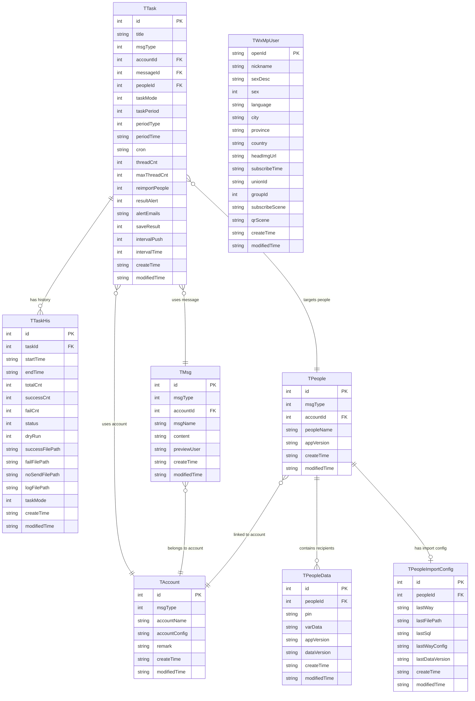

# Data Architecture & Persistence Layer

WePush uses MyBatis 3.5.13 as its ORM layer with 9 mapped tables, backed by an embedded SQLite database for local use and an optional MySQL connection for team scenarios.

## Database Configuration

| Service/Module | DB Type | Profile | Driver | Connection | Migration Tool |
|---|---|---|---|---|---|
| WePush Desktop (primary) | SQLite 3.43 | Default (always active) | `org.sqlite.JDBC` (sqlite-jdbc 3.43.0.0) | `jdbc:sqlite:<CONFIG_HOME>/WePush.db` — in-process file | None; schema initialised from `db_init.sql` at first launch via `MybatisUtil.initDbFile()` |
| WePush Desktop (optional) | MySQL 5.x | User-configured (HikariCP) | `mysql-connector-java 5.1.47` | `jdbc:mysql://<user-configured URL>` managed by `HikariUtil` | None; MySQL is used for people-data queries only (raw SQL via `HikariUtil.executeQuery`) |

No migration tool (Flyway, Liquibase, etc.) is in use. Schema DDL is maintained manually in `db_init.sql` and applied only at initial database creation. Incremental schema changes are handled by `UpgradeUtil`, which runs hand-crafted ALTER TABLE statements on version upgrade.

## Data Ownership per Service

| Service | Tables Owned | ORM Framework | Caching | Notes |
|---|---|---|---|---|
| WePush Desktop App | t_account, t_msg, t_people, t_people_data, t_people_import_config, t_task, t_task_ext (via TTaskExtMapper), t_task_his, t_wx_mp_user | MyBatis 3.5.13 (XML mappers) | None (no second-level cache configured in mybatis-config.xml) | Single-process app; all tables owned by the same application module |
| MySQL (optional) | External user-owned tables (people data import source) | Raw JDBC via HikariUtil | None | MySQL is a read-only import source; application data is always written to SQLite |

## Entity Model

## Key Repository Methods

| Repository | Entity | Notable Custom Methods | Purpose |
|---|---|---|---|
| TTaskMapper | TTask | `selectAll()` | Returns all tasks for the task management UI |
| TTaskExtMapper | TTask | `selectByTitle(String title)`, `selectAll()` | Named-task lookup and full list for Quartz job reload |
| TTaskHisMapper | TTaskHis | `selectByTaskId(Integer taskId)` | Retrieves all run history records for a given task, ordered by `create_time` desc |
| TMsgMapper | TMsg | `selectByMsgTypeAndAccountId(int, Integer)`, `selectByUnique(int, Integer, String)` | Filter messages by channel type + account; uniqueness check on (type, account, name) |
| TAccountMapper | TAccount | `selectByMsgType(int)`, `selectByMsgTypeAndAccountName(int, String)`, `deleteByMsgTypeAndAccountName(int, String)`, `updateByMsgTypeAndAccountName(TAccount)` | Account lookup and management by channel type |
| TPeopleMapper | TPeople | `selectAll()` | Returns all people groups for the people management UI |
| TPeopleDataMapper | TPeopleData | `selectByPeopleId(Integer)`, `selectByPeopleIdLimit20(Integer)`, `selectByPeopleIdAndKeyword(Integer, String)`, `countByPeopleId(Integer)`, `deleteByPeopleId(Integer)` | Recipient list access — full load for push execution, paginated preview, keyword search, count, and bulk delete |
| TPeopleImportConfigMapper | TPeopleImportConfig | `selectByPeopleId(Integer)` | Load the most recent import configuration for a people group |
| TWxMpUserMapper | TWxMpUser | `deleteAll()` | Bulk clear of the WeChat MP user cache table before re-importing followers |

## Caching Strategy

WePush does not use a dedicated caching framework (no Spring Cache, EhCache, Redis, Caffeine, or MyBatis second-level cache is configured). The MyBatis `mybatis-config.xml` uses the default `POOLED` datasource with no cache settings.

**Application-level in-memory maps** are used as lightweight caches:

| Component | Cache Type | Key | Scope | Eviction |
|---|---|---|---|---|
| `HttpMsgSender.okHttpClientMap` | `HashMap<Integer, OkHttpClient>` | Account ID | Static class field | Explicit removal via `removeAccount(id)` on account deletion |
| `MailMsgSender.mailAccountMap` | `HashMap<Integer, MailAccount>` | Account ID | Static class field | Explicit removal via `removeAccount(id)` on account deletion |
| `WxMpTemplateMsgSender.wxMpServiceMap` | `HashMap<Integer, WxMpService>` | Account ID | Static class field | No eviction; service instance reused across sends |

These maps avoid re-initialising expensive SDK clients (HTTP connection pools, WeChat access-token holders) on every send. No TTL, maximum-size, or thread-safe eviction policy is enforced — the maps are unsynchronised `HashMap`s and may exhibit race conditions under concurrent access.

## Data Ownership Boundaries

**Single data store (SQLite)**. All application data lives in a single SQLite file at `<CONFIG_HOME>/WePush.db`. There is no database-per-service separation because WePush is a single-process desktop application. All MyBatis mappers share the same `SqlSession` instance obtained from `MybatisUtil.getSqlSession()`.

**MySQL as import source only**. When the user configures a MySQL data source, the application uses `HikariUtil.executeQuery(sql)` to run a raw SELECT and populate `TPeopleData` records into SQLite. MySQL is never written to and acts purely as an external read source for recipient data.

**No cross-service data access**. Because WePush is a monolithic desktop application, all data access is direct mapper calls within the same process. There are no remote service calls, shared-database multi-tenant scenarios, or CQRS read/write separations.

### Data Classification & Sensitivity

| Entity | Sensitive Fields | Classification | Controls in Place |
|---|---|---|---|
| TAccount | `accountConfig` (stores AppId, AppSecret, API keys, SMTP passwords as JSON) | Confidential / Credentials | No encryption at rest; stored as plaintext JSON in SQLite |
| TWxMpUser | `openId`, `nickname`, `unionId`, `headImgUrl`, `city`, `province`, `country` | PII (WeChat user profile data) | No encryption at rest or masking; stored as plaintext in SQLite |
| TPeopleData | `pin` (user identifier / phone / openId), `varData` (arbitrary variable data) | PII (recipient personal identifiers) | No encryption at rest; stored as plaintext in SQLite |
| TTask | `alertEmails` (email addresses for result notifications) | PII (email addresses) | No encryption at rest; stored as plaintext |
| TMsg | `content` (message body may contain PII if templated with personal data) | Potentially PII | No controls; content stored as plaintext |

**Summary**: The application stores platform credentials (API keys, SMTP passwords) and WeChat user PII without encryption at rest. No field-level access controls, data masking, or audit logging are implemented. The SQLite database file is protected only by operating-system file permissions.
