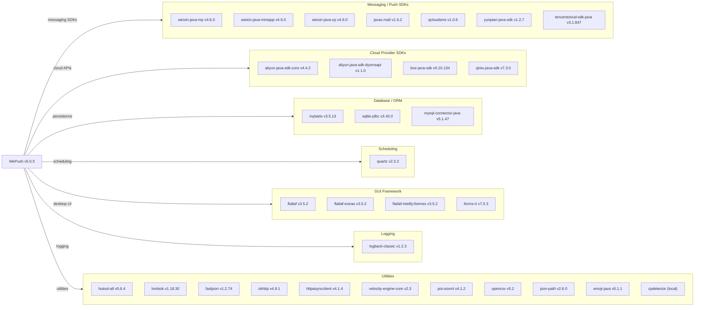

# Dependency Map

WePush is a Java 21 desktop push-notification tool with approximately 35 declared external dependencies spanning messaging SDKs, GUI frameworks, data access, scheduling, and utilities.

## Dependencies

### Dependency Summary

| Category | Count | Key Libraries | Notes |
|---|---|---|---|
| Messaging / Push SDKs | 7 | weixin-java-mp/miniapp/cp 4.6.0, javax.mail 1.6.2, tencentcloud-sdk-java 3.1.847 | Core value-add libraries; WeiXin SDK 4.6.0 is current |
| Cloud Provider SDKs | 4 | aliyun-java-sdk-core 4.4.2, bce-java-sdk 0.10.134, qiniu-java-sdk 7.3.0 | Each SDK pins its own transitive HTTP client versions |
| Database / ORM | 3 | mybatis 3.5.13, sqlite-jdbc 3.43.0.0, mysql-connector-java 5.1.47 | MySQL connector is on the old 5.x branch |
| Scheduling | 1 | quartz 2.3.2 | Quartz 2.3.x is in maintenance mode |
| GUI Framework | 4 | flatlaf 3.5.2, forms-rt 7.0.3 | FlatLaf is actively maintained; forms-rt is IntelliJ-specific |
| Logging | 1 | logback-classic 1.2.3 | Declared as `provided` scope |
| Utilities | 11 | hutool-all 5.6.4, fastjson 1.2.74, okhttp 4.9.1, poi-ooxml 4.1.2 | Several outdated versions (see risks below) |

### Version & Compatibility Risks

**mysql-connector-java 5.1.47** is on the legacy GPL 5.x driver line, which reached end-of-active-development; the current connector is 8.x (Connector/J). **fastjson 1.2.74** has multiple known CVEs in the 1.x series (arbitrary code execution via auto-type deserialization); the library was superseded by fastjson2. **logback-classic 1.2.3** predates the CVE-2021-42550 fix (patched in 1.2.9+) and the newer 1.5.x/2.x releases. **httpasyncclient 4.1.4** depends on the legacy Apache HttpComponents 4.x stack, which is in maintenance mode. **quartz 2.3.2** (2019) is the last stable release on the 2.x branch with no planned 3.x successor, limiting cloud-native scheduling migration options. **HikariCP** is defined in `<properties>` at version 3.4.5 but its `<dependency>` block is commented out, meaning the connection pool is either pulled transitively or not used at runtime.

### Notable Observations

- **Overlapping HTTP client libraries**: The project simultaneously declares `okhttp`, `httpasyncclient` (Apache HC4), and each WeChat/Cloud SDK brings its own HTTP client transitively, leading to multiple competing HTTP stacks on the classpath.
- **Local/vendored JARs**: `cpdetector`, `antlr`, `chardet`, `jargs`, and `taobao-sdk-java-auto` are declared via `<scope>system</scope>` with paths under `src/main/lib`, which is incompatible with standard Maven build pipelines and CI/CD.
- **fastjson 1.x security risk**: `fastjson 1.2.74` is in the 1.x series known for critical deserialization CVEs. Upgrading to fastjson2 or Jackson requires API changes throughout the codebase.
- **No connection-pool JAR declared**: HikariCP is referenced in source code (`HikariUtil.java`) but its Maven dependency is commented out; the pool may arrive only as a transitive dependency of another library.

## Test Dependencies

| Framework | Version | Notes |
|---|---|---|
| JUnit | 4.13.1 | Classic JUnit 4 (test scope); no migration to JUnit 5 detected |

Total test-scope dependencies: 1

Only a single test dependency (JUnit 4) is declared. There is no mocking library (Mockito), assertion library (AssertJ/Hamcrest beyond built-ins), or integration test framework detected. Test coverage is therefore expected to be minimal for this desktop application.
