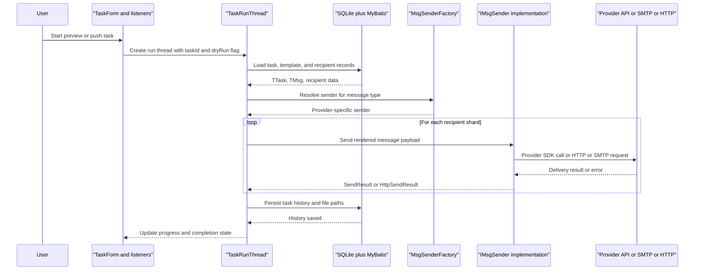

# API & Service Communication Contracts

WePush does not expose an inbound HTTP or RPC API from this repository; instead, it offers a local desktop interaction surface and several outbound service contracts to third-party messaging providers. Communication is primarily synchronous method invocation inside one process, followed by outbound SDK, SMTP, or HTTP calls during preview and push execution.

## Service Catalog

| Service | Port | Category | Purpose |
|---|---|---|---|
| `WePush` desktop application | N/A | Business | Single executable that manages accounts, templates, recipients, and batch push tasks |
| External messaging providers | Provider-defined | API Layer | Receive outbound requests from sender implementations for WeChat, SMS, email, and HTTP delivery |

## API Endpoints Inventory

| Service | Method | Path | Request Type | Response Type |
|---|---|---|---|---|
| WePush desktop application | N/A | No inbound HTTP endpoints detected | Swing event payloads and local DTOs | UI state updates, `SendResult`, persisted task history |
| Generic HTTP push target | Configured by user | User-supplied URL in HTTP account/message config | `HttpMsg`-driven request body and headers | `HttpSendResult` plus remote HTTP status |

## Management & Observability Endpoints

| Service | Endpoint | Custom Metrics |
|---|---|---|
| WePush desktop application | None detected | None detected |
| External providers | Out of scope | Provider-side monitoring only |

## DTOs & Contracts

The repository uses POJO-style contracts rather than network DTO schemas such as OpenAPI or protobuf. Key contract classes include account configuration beans such as `WxMpAccountConfig`, `AliYunAccountConfig`, `EmailAccountConfig`, and `HttpAccountConfig`; message payload beans such as `MailMsg` and `HttpMsg`; domain-backed task inputs such as `TTask`, `TMsg`, `TPeople`, and `TPeopleData`; and response objects such as `SendResult` and `HttpSendResult`.

Most contracts are mutable Java classes populated by UI forms, MyBatis, or JSON parsing. No API gateway DTOs, OpenAPI specifications, GraphQL schemas, or protobuf definitions were found. Serialization is handled ad hoc through Fastjson, Hutool JSON helpers, provider SDKs, and message-specific request builders.

## Communication Patterns

Communication inside the application is synchronous and in-process: Swing listeners invoke helper classes, task threads query MyBatis mappers, and `MsgSenderFactory` chooses an `IMsgSender` strategy. During push execution, the application fans out recipient data across multiple virtual-thread-backed sender tasks, but each sender still performs provider communication through direct SDK or HTTP client calls.

No inbound service discovery, API gateway, circuit breaker, or centralized retry framework was detected. Transport security and authentication are delegated to each provider SDK or remote endpoint configuration; the repository does not define a shared API security layer, TLS termination, or authorization policy because it is not a server application. Startup ordering only affects local availability: the SQLite database, upgrade logic, and UI tabs must initialize before task execution becomes usable.

## Service Technology Matrix

| Service | Web | Data Access | Discovery | Gateway | Actuator | Cache | Metrics |
|---|---|---|---|---|---|---|---|
| WePush desktop application | None | MyBatis plus SQLite | None | None | None | None detected | None detected |
| External provider integrations | Provider-specific remote APIs | None in repo | Provider-hosted | None | None in repo | None in repo | None in repo |

## Service Communication Sequence

