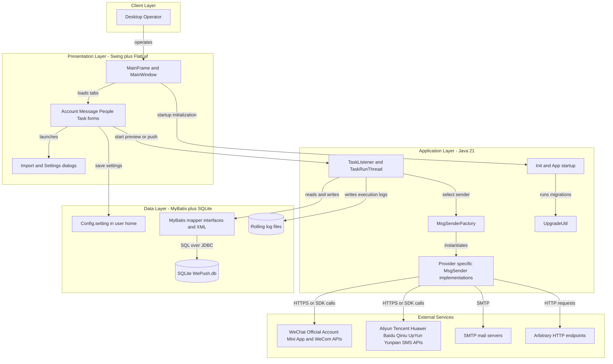
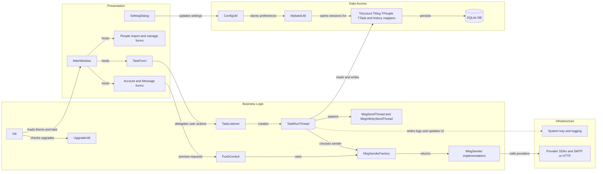

# Architecture Diagram

WePush is a single-process Java desktop application for configuring batch messaging accounts, authoring message templates, preparing recipient groups, and executing or scheduling bulk push jobs. The architecture is organized around Swing presentation components, in-process task orchestration, a local SQLite persistence layer, and outbound integrations to messaging providers.

## Application Architecture

### Technology Stack Summary

| Layer | Technology | Version | Purpose |
|---|---|---:|---|
| Presentation | Swing, IntelliJ GUI Designer, FlatLaf | forms_rt 7.0.3, FlatLaf 3.5.2 | Desktop UI, dialogs, themed tabbed workflow |
| Application | Java | 21 | Local task orchestration, preview, scheduling, upgrade flow |
| Persistence | MyBatis, SQLite JDBC | 3.5.13, 3.43.0.0 | Local relational storage for accounts, messages, recipients, and task history |
| Scheduling | Hutool cron, virtual threads | bundled, Java 21 | Scheduled task execution and concurrent message dispatch |
| Integration | WeChat, SMS cloud SDKs, JavaMail, OkHttp | mixed | Outbound delivery to messaging providers and arbitrary HTTP endpoints |
| Build and packaging | Maven, javapackager | Maven, 1.7.5 plugin | Build JAR and package desktop installers |

### Data Storage & External Services

The application stores its operational state locally in a SQLite database under the user home directory and keeps user preferences in a separate Hutool `config.setting` file. Outbound integrations are concentrated in message sender implementations that call WeChat APIs, multiple SMS providers, SMTP servers, and generic HTTP endpoints; there is no separate server-side application or message broker in the repository.

### Key Architectural Decisions

- Uses a single desktop executable with in-process orchestration instead of a client-server split, so UI actions invoke business logic directly.
- Persists operational state in a local SQLite database accessed through MyBatis mapper interfaces and XML mappings.
- Encapsulates channel-specific delivery logic behind `IMsgSender` plus `MsgSenderFactory`, allowing one task workflow to target many provider SDKs.

## Component Relationships

### Component Inventory

| Component | Layer | Type | Responsibility |
|---|---|---|---|
| `App` | Business Logic | Entry point | Boots the desktop app, applies OS-specific settings, and initializes the main frame |
| `Init` | Business Logic | Initializer | Applies themes, fonts, tray behavior, upgrade checks, and tab initialization |
| `MainFrame` and `MainWindow` | Presentation | JFrame and form container | Hosts the tabbed workflow for account, message, people, and task management |
| `AccountManageForm` / `AccountEditForm` | Presentation | Swing forms | Manage channel accounts and provider credentials |
| `MessageManageForm` / `MessageEditForm` | Presentation | Swing forms | Manage reusable message templates and preview data |
| `PeopleManageForm` / `PeopleEditForm` | Presentation | Swing forms | Manage recipient groups and import flows |
| `TaskForm` | Presentation | Swing form | Configure and inspect push tasks and task history |
| `TaskListener` | Business Logic | Event listener | Responds to task UI actions, starts or stops jobs, and manages scheduled tasks |
| `PushControl` | Business Logic | Controller helper | Runs message preview requests against selected sample recipients |
| `TaskRunThread` | Business Logic | Orchestrator thread | Loads task data, shards recipients, records history, and supervises send threads |
| `MsgSenderFactory` | Business Logic | Factory | Maps a message type to the appropriate sender implementation |
| `IMsgSender` implementations | Business Logic | Strategy implementations | Deliver messages through WeChat, SMS, email, or HTTP providers |
| `ConfigUtil` | Data Access | Configuration gateway | Reads and stores user preferences and sensitive mail or MySQL settings |
| `MybatisUtil` | Data Access | Session factory helper | Initializes the SQLite database and provides the shared MyBatis session |
| `TAccountMapper`, `TMsgMapper`, `TPeopleMapper`, `TTaskMapper`, `TTaskHisMapper` | Data Access | Mapper interfaces | CRUD access for accounts, templates, recipients, tasks, and execution history |
