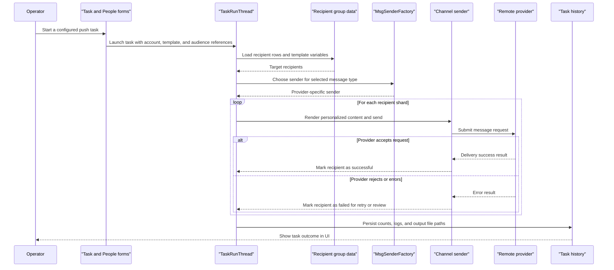

# Core Business Workflows

WePush helps an operator configure outbound messaging channels, prepare recipient datasets, and run bulk or scheduled delivery jobs from a desktop UI. Its core business value is coordinating many message providers behind one repeatable workflow for account setup, template management, audience preparation, and execution tracking.

## Domain Entities

| Entity | Service / Bounded Context | Description | Key Relationships |
|---|---|---|---|
| `TAccount` | Messaging configuration | Stores a named provider account and the credentials or connection settings needed to send messages | Owns many `TMsg` templates and `TPeople` groups |
| `TMsg` | Message authoring | Represents a reusable message template bound to one channel/account combination | Referenced by many `TTask` records |
| `TPeople` | Audience management | Represents a logical recipient group for one account or channel | Owns many `TPeopleData` rows and one import config |
| `TPeopleData` | Audience management | Stores recipient identifiers and template variables for one audience group | Belongs to one `TPeople`; consumed by push tasks |
| `TPeopleImportConfig` | Audience import | Remembers how a group was imported so scheduled jobs can re-import before running | Belongs to one `TPeople` |
| `TTask` | Push execution | Defines what to send, with which account, to which group, and on what schedule | References one account, one template, one group; owns many history rows |
| `TTaskHis` | Push execution | Records one execution attempt, including counts, status, and output files | Belongs to one `TTask` |
| `TWxMpUser` | WeChat audience sync | Persists imported WeChat public-account user data for later selection or targeting | Used by WeChat audience import flows |

## Service-to-Domain Mapping

| Service | Domain Context | Owned Entities | External Dependencies |
|---|---|---|---|
| WePush desktop application | Account and credential management | `TAccount` | WeChat, SMS, email, and HTTP provider account forms |
| WePush desktop application | Message authoring | `TMsg` and message-specific bean classes | Provider-specific template semantics |
| WePush desktop application | Audience management | `TPeople`, `TPeopleData`, `TPeopleImportConfig`, `TWxMpUser` | File import, SQL import, WeChat import, DingTalk import |
| WePush desktop application | Task scheduling and execution | `TTask`, `TTaskHis`, `TTaskExt` | Hutool scheduling, provider SDKs, SMTP, HTTP clients |

## Primary Workflows

### Workflow 1: Configure a delivery channel and template

1. The operator selects a message type in `MessageTypeForm` and opens the matching account and message forms.
2. Account edit forms collect provider credentials or connection settings and persist them to `TAccount`.
3. Message edit forms capture template content, preview users, and message metadata, then persist them to `TMsg`.
4. The workflow establishes the account-template pairing that later tasks can execute repeatedly.

### Workflow 2: Prepare a target audience

1. The operator creates or selects a people group in `PeopleManageForm`.
2. Recipient data is imported from file, SQL, WeChat, WeCom, DingTalk, or numeric/manual input dialogs.
3. Imported rows are normalized into `TPeopleData` entries, including variable arrays used for message rendering.
4. The last import method is saved in `TPeopleImportConfig` so scheduled tasks can optionally refresh the audience automatically.

### Workflow 3: Execute or schedule a push task

1. The operator creates a `TTask` that references one account, one message template, and one recipient group.
2. The task definition captures mode, thread count, timing strategy, optional re-import, and result-alert settings.
3. `TaskListener` starts a `TaskRunThread` immediately or registers a scheduled execution.
4. `TaskRunThread` loads recipients, shards the workload, and creates provider-specific senders through `MsgSenderFactory`.
5. Sender threads render message variables, call the remote provider, and accumulate success or failure counts.
6. Results are written to `TTaskHis`, optional files are generated, and alert email can be sent after completion.

## Cross-Service Data Flows

There are no multiple deployable services inside the repository, but there are important cross-boundary data flows between the desktop app and external providers. Account configuration determines which SDK or protocol is used; recipient and template data are merged at execution time; and the resulting outbound request is sent to a remote provider such as WeChat, SMS, SMTP, or a generic HTTP endpoint.

If a remote provider is unavailable, the business outcome is degradation at the recipient level rather than a separate service fallback. Failures are recorded in task history and result files so the operator can inspect or retry deliveries later, but no circuit-breaker orchestration or alternate downstream service was detected.

## Business Workflow Sequence

## Business Rules & Decision Logic

- A task is only executable once it references a saved account, a saved message template, and a saved recipient group.
- The selected message type drives several important decisions: which account form is shown, which message editor is used, and which `IMsgSender` implementation is instantiated.
- Scheduled tasks may re-import recipient data before execution when `reimportPeople` is enabled and a prior import method has been recorded.
- Recipient variables are expanded at send time, allowing one template to produce personalized content per row.
- Task history captures total, success, and failure counts so operators can distinguish complete, partial, and failed runs.
- Stopping a running task is cooperative: listener actions flip the thread `running` flag so execution winds down cleanly rather than forcing abrupt termination.
