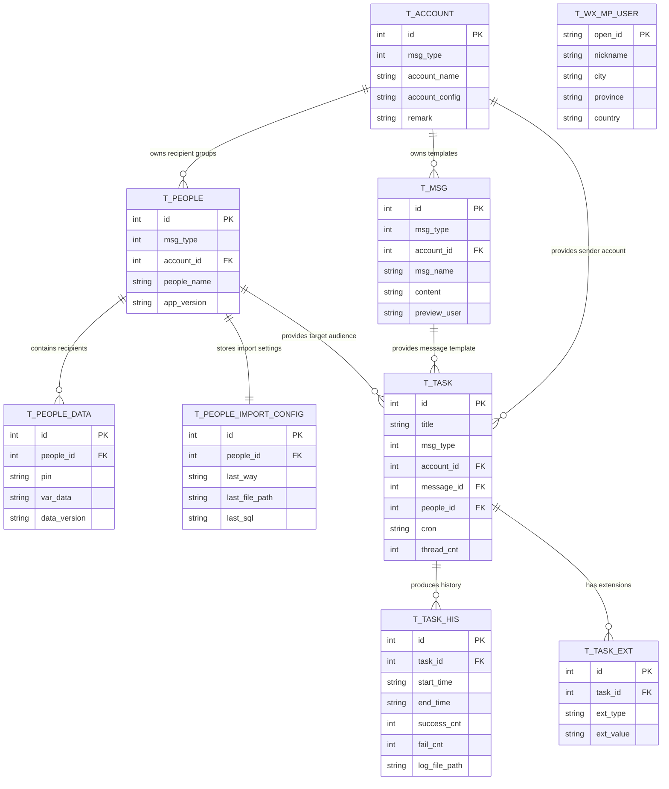

# Data Architecture & Persistence Layer

WePush persists almost all operational state in a single local SQLite database and accesses it through MyBatis mapper interfaces plus XML mappings. The data model centers on accounts, message templates, recipient groups, recipient records, scheduled tasks, and task execution history.

## Database Configuration

| Service/Module | DB Type | Profile | Driver | Connection | Migration Tool |
|---|---|---|---|---|---|
| Desktop application runtime | SQLite | Default local runtime | `org.sqlite.JDBC` | `jdbc:sqlite:<user-home>/.WePush5/WePush.db` | Schema bootstrap from `db_init.sql`; incremental SQL scripts under `resources/upgrade/` |
| Recipient import capability | MySQL | Optional external import settings | `mysql-connector-java` 5.1.47 | User-supplied URL, user, and password stored in config settings | No repository-managed migration flow for external MySQL |

## Data Ownership per Service

| Service | Tables Owned | ORM Framework | Caching | Notes |
|---|---|---|---|---|
| `WePush` desktop application | `t_account`, `t_msg`, `t_people`, `t_people_data`, `t_people_import_config`, `t_task`, `t_task_his`, `t_task_ext`, `t_wx_mp_user` | MyBatis over SQLite JDBC | None detected | Single-process ownership; no separate service boundaries inside the repository |

## Entity Model

## Key Repository Methods

| Service | Repository | Notable Methods | Purpose |
|---|---|---|---|
| WePush | `TAccountMapper` | `selectByMsgType`, `selectByMsgTypeAndAccountName`, `updateByMsgTypeAndAccountName` | Resolve and upsert provider account records by channel and name |
| WePush | `TMsgMapper` | `selectByUnique`, `selectByMsgTypeAndAccountId` | Retrieve message templates for a selected account and enforce logical uniqueness |
| WePush | `TPeopleMapper` | `selectByMsgTypeAndAccountIdAndName`, `selectByMsgTypeAndAccountId` | Find recipient groups for a specific channel and account |
| WePush | `TPeopleDataMapper` | `selectByPeopleId`, `selectByPeopleIdLimit20`, `countByPeopleId`, `selectByPeopleIdAndKeyword`, `deleteByPeopleId` | Load, count, search, and purge recipient records for one group |
| WePush | `TPeopleImportConfigMapper` | `selectByPeopleId` | Recover the last import mechanism so scheduled jobs can re-import recipients |
| WePush | `TTaskMapper` | `selectAll`, `selectByPrimaryKey` | Enumerate configured tasks and load one task definition for execution |
| WePush | `TTaskHisMapper` | `selectByTaskId` | Query execution history and related output artifacts |

## Caching Strategy

No explicit caching layer was detected. The application reads settings from a singleton `ConfigUtil`, reuses one shared MyBatis `SqlSession`, and keeps in-memory task/thread maps during execution, but there is no provider-backed cache, TTL policy, cache region, or second-level ORM cache configured in the repository.

## Data Ownership Boundaries

All durable application data is stored in one local SQLite database owned by the desktop application, so the topology is a shared single-database model rather than service-isolated persistence. Cross-component data access happens through direct MyBatis mapper calls inside the same process; external provider APIs are used for delivery only and do not own the core account, template, recipient, or task records.

### Data Classification & Sensitivity

| Entity | Sensitive Fields | Classification | Controls in Place |
|---|---|---|---|
| `TAccount` | `account_config` may contain API keys, app secrets, SMTP credentials, webhook tokens | PII/Secrets | Stored as plain application data; no field-level encryption or masking detected |
| `TMsg` | `content`, `preview_user` may contain contact identifiers and business message bodies | PII | No masking or encryption detected in repository |
| `TPeople` | `people_name` may identify audience groups | PII | No masking or encryption detected |
| `TPeopleData` | `pin`, `var_data` may contain recipient identifiers, phone numbers, emails, and template variables | PII | No masking or encryption detected |
| `TPeopleImportConfig` | `last_file_path`, `last_sql`, `last_way_config` may expose import locations or connection details | Sensitive operational data | No masking or encryption detected |
| `TTask` and `TTaskHis` | `alert_emails`, file paths, execution artifacts | PII/Operational | No masking or encryption detected |
| `TWxMpUser` | openId, nickname, city, province, country, unionId, remark | PII | No masking or encryption detected |
