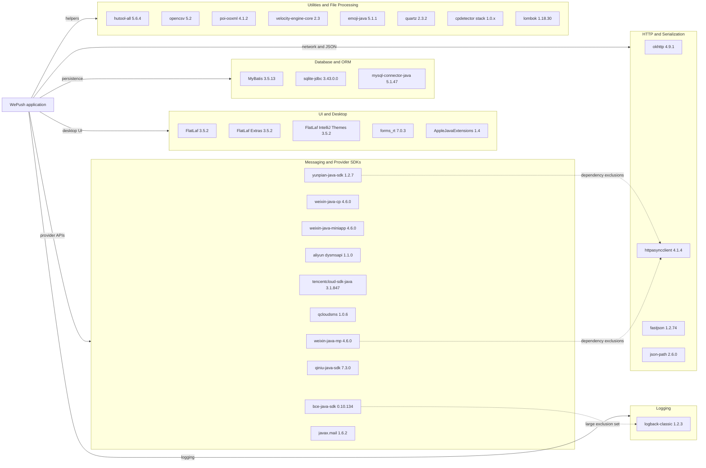

# Dependency Map

This Maven-based Java desktop application declares roughly thirty-five direct dependencies spanning desktop UI, local persistence, cloud messaging SDKs, and utility libraries. The dependency mix is integration-heavy because a single executable supports many outbound messaging channels.

## Dependencies

### Dependency Summary

| Category | Count | Key Libraries | Notes |
|---|---:|---|---|
| UI and Desktop | 5 | FlatLaf, forms_rt, AppleJavaExtensions | Desktop look-and-feel and installer packaging support |
| Database and ORM | 3 | MyBatis, sqlite-jdbc, mysql-connector-java | Local SQLite is primary; MySQL import support is also configured |
| Messaging and Provider SDKs | 10 | WeChat SDKs, Aliyun, Tencent, Baidu, Qiniu, Yunpian, JavaMail | Largest category because one executable serves many delivery channels |
| HTTP and Serialization | 4 | OkHttp, HttpAsyncClient, fastjson, json-path | Used for provider integrations and HTTP push mode |
| Logging | 1 | Logback | Central logging implementation |
| Utilities | 8 | Hutool, OpenCSV, POI, Quartz, Velocity, cpdetector, Lombok | File import, scheduling, templating, and general helper functionality |

### Version & Compatibility Risks

Several declared dependencies are dated relative to the Java 21 target level. `mysql-connector-java` 5.1.47 is end-of-life, `logback-classic` 1.2.3 predates current security and maintenance updates, `hutool-all` 5.6.4 and `httpasyncclient` 4.1.4 are older utility/network baselines, and `fastjson` 1.2.74 is especially notable because it has a long history of security concerns and migration pressure toward safer JSON libraries.

### Notable Observations

- The repository relies on a wide set of provider SDKs instead of isolating each channel into a separate module, so dependency upgrades can have broad blast radius.
- Multiple dependencies declare explicit exclusions, especially the Baidu SDK, indicating ongoing transitive dependency conflict management.
- The build uses local `lib/*.jar` installation steps for Taobao and cpdetector artifacts, which also explains why baseline Maven resolution is sensitive to repository and clean-phase behavior.
- Local desktop concerns and cloud-provider integrations coexist in one artifact, making the dependency graph unusually diverse for a single-process app.

## Test Dependencies

| Framework | Version | Notes |
|---|---:|---|
| JUnit | 4.13.1 | Legacy unit-test framework used by the existing `CommonTest` class |

Total test-scope dependencies: 1

Test infrastructure is minimal and focused on basic local checks rather than layered unit, integration, or contract testing. No mocking, integration-container, or UI-test libraries are declared in `pom.xml`.
